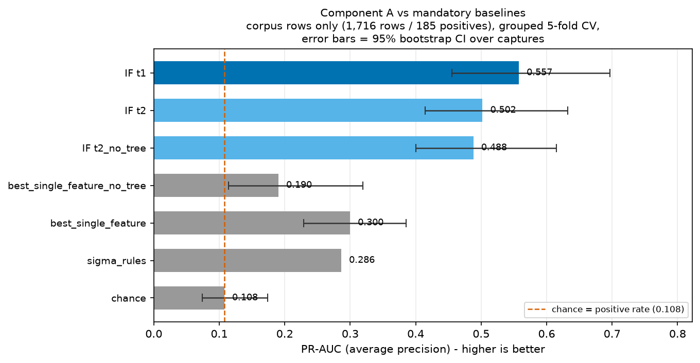
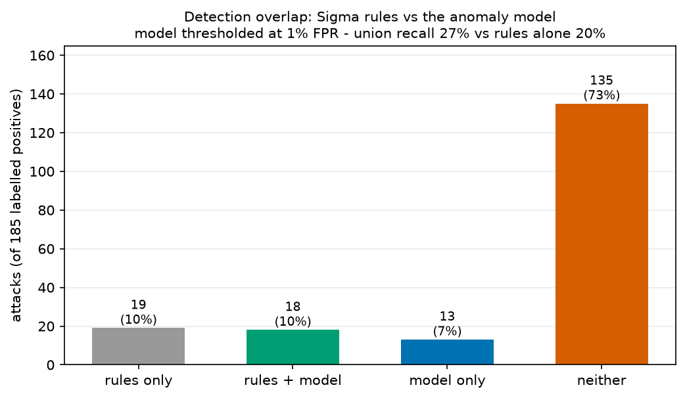
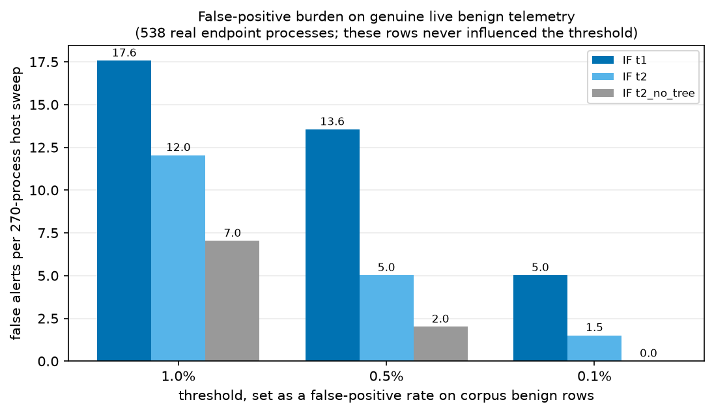
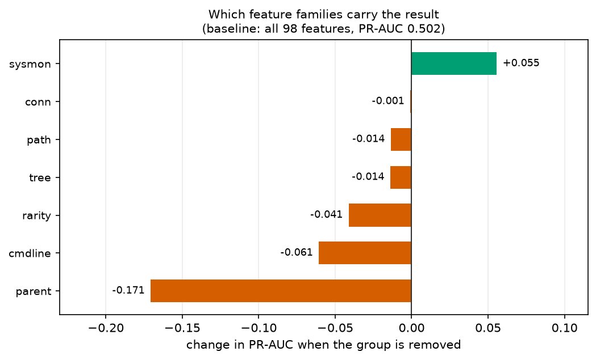
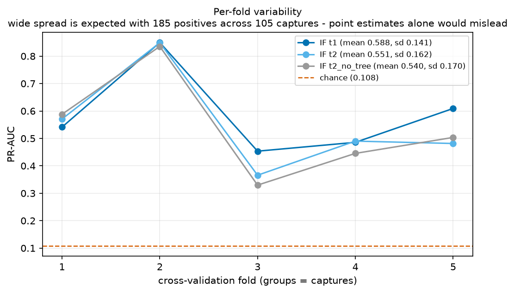

# ML_EVALUATION.md — Component A: process anomaly detection

**Generated from** `reports_ml/anomaly_eval.json` (produced by
`python -m ml.training.train_anomaly`). Figures in `reports_ml/figures/`.
**Feature spec** `9225377386b539d6…` · **seed** 42 · **scikit-learn** 1.9.1 · CPU only.

Reproduce end to end:
```bash
.venv-ml313/Scripts/python.exe -m ml.datasets.otrf fetch
.venv-ml313/Scripts/python.exe -m ml.datasets.otrf_etl --rebuild
.venv-ml313/Scripts/python.exe -m ml.datasets.labels
.venv-ml313/Scripts/python.exe -m ml.training.train_anomaly --save
.venv-ml313/Scripts/python.exe -m ml.evaluation.figures
```

---

## 1. Summary

The deterministic engine answers *"does this match a known rule?"*. Component A answers
*"is this unusual?"* — the proactive threat-hunting capability the internship subject asks
for, and the only one that can surface behaviour nobody has written a rule for.

**It works, with a clearly bounded scope.** An IsolationForest baseline of normal process
behaviour reaches **PR-AUC 0.557 (95% CI 0.455–0.697)** against a chance floor of 0.108 — a
**5.2× lift** — and comfortably beats all three mandatory baselines, with non-overlapping
confidence intervals against the best of them. Of the top 25 ranked processes, **21 are
genuine attacks**.

**It is not an alerting mechanism.** At a 1% false-positive rate it recovers only 22% of
attacks, and at thresholds low enough to keep false alerts tolerable on real endpoints its
recall collapses to a few percent. Component A should ship as a **ranked triage queue**, not
as something that raises alarms on its own.

**It adds detections the rules miss.** The Sigma ruleset catches 37 of 185 attacks (20%) with
*perfect precision*. The model surfaces **13 more that no rule fired on**, lifting union
recall from 20% → 27%, at a cost of 16 additional false positives.

---

## 2. What was measured, and on what

| | |
|---|---|
| Rows | 2,254 (1,716 OTRF corpus + 538 real local benign) |
| Positives | 185 (10.8% of the evaluated population) |
| CV groups | 107 captures/collections; `GroupKFold`, 5 folds |
| Features | 98 (79 T1 psutil-computable / 19 T2 Sysmon-derived) |

**Ranking metrics are computed on corpus rows only (1,716).** Every positive lives in the
corpus and the local rows are 100% benign, so any feature separating the two sources hands
the model a free "this cannot be an attack" signal — and `sysmon_available` separates them
perfectly (1.000 corpus vs 0.000 local), as does `cmdline_present` (1.000 vs 0.725). Scoring
across both would have credited the model for discarding 538 trivially-identifiable
negatives. The local rows are still used for two things: they join the benign baseline the
model is fitted on, and they provide an **independent false-positive measurement** (§5).

Accuracy is never reported. At a 10.8% positive rate, answering "benign" always scores 89.2%.

---

## 3. Headline results



| Model | PR-AUC | 95% CI | lift | ROC-AUC | Recall @1% FPR | Precision@25 |
|---|---|---|---|---|---|---|
| chance | 0.108 | 0.074–0.174 | 1.0× | 0.504 | 0.5% | 0.04 |
| **Sigma rules (deployed)** | 0.286 | — | 2.7× | 0.600 | n/a | n/a |
| best single feature | 0.300 | 0.229–0.385 | 2.8× | 0.814 | 69.2% | 0.12 |
| best single feature (no tree) | 0.190 | 0.114–0.320 | 1.8× | 0.615 | 50.8% | 0.16 |
| IsolationForest **T2** (98 feat) | 0.502 | 0.414–0.632 | 4.7× | 0.909 | 16.8% | 0.64 |
| IsolationForest T2, no tree (94) | 0.488 | 0.400–0.615 | 4.5× | 0.909 | 13.0% | 0.64 |
| **IsolationForest T1 (79 feat)** | **0.557** | **0.455–0.697** | **5.2×** | **0.910** | **22.2%** | **0.84** |

The Sigma row carries `n/a` deliberately. It is a **binary** scorer, so "recall at 1% FPR" is
meaningless for it: every benign row scores 0, the 99th-percentile threshold is therefore 0,
`score ≥ 0` matches everything, and the metric returns *recall 1.0 at an actual FPR of 100%*.
The harness detects binary scorers and refuses to print the flattering number
(`core_metrics.binary_scorer`); the confusion matrix below is the honest summary.

**Sigma rules, at their own operating point:** TP 37 · FP 0 · FN 148 · TN 1,531 →
**precision 1.000, recall 0.200**. Exactly what good rules do: narrow, certain. Four of the
ten rules fired (encoded PowerShell 31, schtasks 3, whoami 2, mimikatz 1).

---

## 4. Does the model add anything the rules don't?

This is the question that decides whether Layer 4.5 ML earns its operational cost.



At a 1% false-positive threshold, over 185 labelled attacks:

| | attacks |
|---|---:|
| Caught by rules only | 19 |
| Caught by both | 18 |
| **Caught by the model only** | **13** |
| Caught by neither | 135 |

**Union recall 27.0% vs 20.0% for rules alone** — a **+7pp absolute gain**, recovering 8.8%
of the attacks rules miss, for **16 extra false positives**.

Honest reading: a real but modest gain. It supports running ML findings in a **separate
review lane** rather than merging them into the main detection stream — which is what the
`approvals_queue` workflow already in the framework is built for. And 135 attacks (73%) are
caught by *neither*, which is the strongest argument in this report for continued detection
engineering rather than for more ML.

---

## 5. False positives on real endpoint data — and a calibration trap

The 538 local rows are genuine processes from a live workstation that nobody is attacking.
They took no part in choosing the threshold, so they are an honest test of what an analyst
would actually experience.



Alerts per 270-process host sweep, thresholds set on **corpus** benign rows:

| Threshold (corpus FPR) | IF T1 | IF T2 | IF T2 no-tree |
|---|---:|---:|---:|
| 1.0% | 17.6 | 12.0 | 7.0 |
| 0.5% | 13.6 | 5.0 | 2.0 |
| 0.1% | 5.0 | 1.5 | **0.0** |

**Finding — thresholds calibrated on the corpus badly under-state real false positives.**
A threshold set to 1% FPR on corpus benign rows produces a **6.5% false-positive rate on real
local benign data** — roughly 6× worse than advertised. The corpus's benign background (lab
domain controllers and workstations) is simply cleaner and more uniform than a real developer
workstation full of browsers, updaters and vendor agents.

**Operational consequence:** the deployment threshold must be calibrated on *each estate's own
benign baseline*, never inherited from training. This is implemented as the percentile
mapping in `ml_anomaly.AnomalyModel` — the stored score is a percentile of whatever baseline
the model was fitted on, so re-fitting on a customer's own data re-calibrates automatically.

**Finding — best ranking and lowest false positives are different models.** T1 ranks best
(PR-AUC 0.557) but has the *worst* real-world false-positive burden (17.6 alerts/sweep at 1%).
T2-no-tree ranks slightly lower (0.488) and is by far the cleanest in practice (7.0, and 0.0
at 0.1%). Corpus ranking performance and deployed nuisance rate are not the same objective,
and choosing a model on PR-AUC alone would have picked the noisier one.

---

## 6. Ablations



Leave-one-feature-group-out, from the 98-feature T2 model (PR-AUC 0.502):

| Removed | PR-AUC | Δ | Reading |
|---|---:|---:|---|
| parent | 0.331 | **−0.171** | Parent/lineage context is the single most load-bearing family — consistent with DFIR practice, where *what spawned it* matters more than the process itself |
| cmdline | 0.441 | −0.061 | Command-line content is the second pillar |
| rarity | 0.461 | −0.041 | Fitted name/lineage rarity contributes real signal |
| path | 0.488 | −0.014 | |
| tree | 0.488 | −0.014 | Small — see below |
| conn | 0.501 | −0.001 | Nothing: 94% missing in the corpus |
| **sysmon** | **0.557** | **+0.056** | Removing Sysmon features *improves* the model |

### 6.1 The `sibling_count` artefact — and why it turned out not to matter
Malicious processes have a median `sibling_count` of **0**, against 4 (corpus benign) and 26
(local benign), and that one feature alone reaches ROC-AUC 0.866. That is largely an artefact
of **lineage labelling**: labelling an attacker's subtree produces small families by
construction, while benign background is dominated by `services.exe`/`svchost.exe` sibling
sets. A real deployment would not enjoy that separation.

Removing the tree family costs the *model* almost nothing (0.502 → 0.488) but costs the
*single-feature baseline* a great deal (0.300 → 0.190). So the artefact was inflating the
**baseline**, not the model — and with it removed, the model's advantage is larger, not
smaller. The conclusion survives the correction.

### 6.2 Sysmon features actively hurt (−0.056 PR-AUC)
Counter-intuitive but consistent: IsolationForest isolates points by random axis-aligned
splits, so 19 additional low-variance columns dilute the probability of splitting on an
informative one. With 185 positives, the extra dimensionality costs more than the signal
gains.

**This is not an argument against installing Sysmon.** Sysmon is what gives the *rules* their
coverage, and what gives the corpus its command lines. It is an argument that *this
unsupervised component* should run on the T1 feature set. Whether Sysmon features help the
supervised components (B and C) is a separate question, and is deliberately left open until
they are built.

---

## 7. Stability and uncertainty



Per-fold PR-AUC: T1 `[0.54, 0.85, 0.45, 0.49, 0.61]` (mean 0.588, **sd 0.141**).

The spread is wide, and that is the honest headline rather than a footnote. With 185 positives
across 105 captures, each fold rests on ~37 positives. All intervals are **group** bootstraps
(resampling whole captures): a row bootstrap would treat 15 processes from one attack as 15
independent observations and report intervals several times too narrow.

What survives the uncertainty: the model's CI (0.455–0.697) does not overlap the best
baseline's (0.229–0.385). What does not: the T1-vs-T2 difference (−0.056) sits well inside
fold-to-fold noise and should be treated as a weak preference, not a finding.

---

## 8. Threats to validity

1. **Weak labels.** Labels come from heuristic seed signatures plus lineage propagation, not
   from ground truth emitted by the emulation harness. 26 captures yield no seed at all and
   are therefore entirely benign-labelled — some of those almost certainly contain attacks
   that are silently counted as false positives, so reported precision is a **lower bound**.
2. **Seed/feature overlap.** Seeds match encoded-PowerShell patterns, and
   `cmdline_has_encoded_flag` is a feature. Deliberately avoided in the worst case — seeding
   on "executable under `\Downloads\`" was rejected precisely because `path_category` already
   encodes it — but residual overlap remains and inflates results to an unmeasured degree.
3. **One benign workstation.** All 538 local rows come from a single physical machine (live
   hosts 5 and 7 are the same box enrolled twice). The real-world false-positive estimate in
   §5 rests on that one machine and should not be read as a fleet-wide figure.
4. **Windows only.** The subject covers Linux; the corpus does not. Linux behaviour is
   **not validated** by this evaluation.
5. **Snapshot vs event-stream skew.** Sysmon EID 1 records every launch; a psutil sweep sees
   only survivors. Short-lived attacker processes are over-represented in training relative
   to what a 60-second sweep would capture, so corpus recall is an **upper bound** for a
   psutil-only deployment.
6. **Small N.** 185 positives, 8 tactics, 3 of which have fewer than 10 examples.

---

## 9. Recommendations

**For the framework**
1. **Deploy Component A as a ranked triage queue**, not an alarm. Precision@25 of 0.84 makes
   "review the 25 most anomalous processes per host" a good use of an analyst's time; a 22%
   recall at 1% FPR does not make a good alert.
2. **Route ML findings to a separate review lane** (`approvals_queue` with
   `rule_type='ml_anomaly'`) until the false-positive rate is measured on the target estate.
3. **Calibrate the threshold on the target estate's own benign baseline.** §5 shows a corpus
   threshold under-states real false positives ~6×.
4. **Run the agent elevated.** It currently cannot read the command line of **27% of live
   processes** — `svchost.exe`, `System`, `Registry`, `csrss.exe`, `LsaIso.exe` — i.e.
   precisely the names attackers masquerade as, and `cmdline` is the second most load-bearing
   feature family.
5. **Keep writing rules.** 73% of attacks are caught by neither rules nor model. The rules
   that exist have *perfect precision*; the gap is coverage, not quality.

**For the ML work**
6. Use **T1 features** for this component; Sysmon features hurt it (§6.2).
7. Report **precision@k**, not recall-at-FPR, as the operational headline.
8. The 26 unseeded captures are the cheapest available improvement: better seeds there would
   both add positives and remove false negatives from the benign class.
