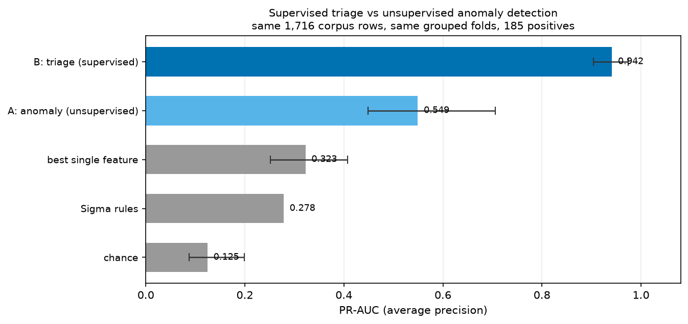
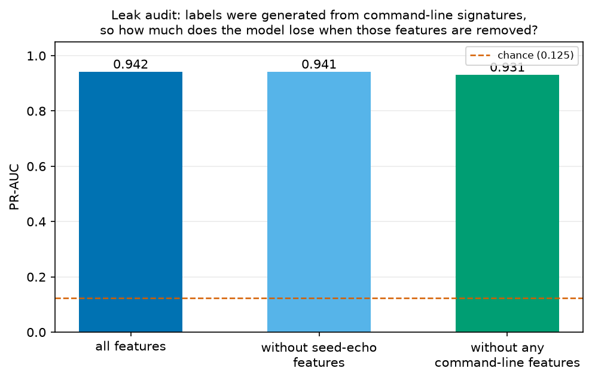
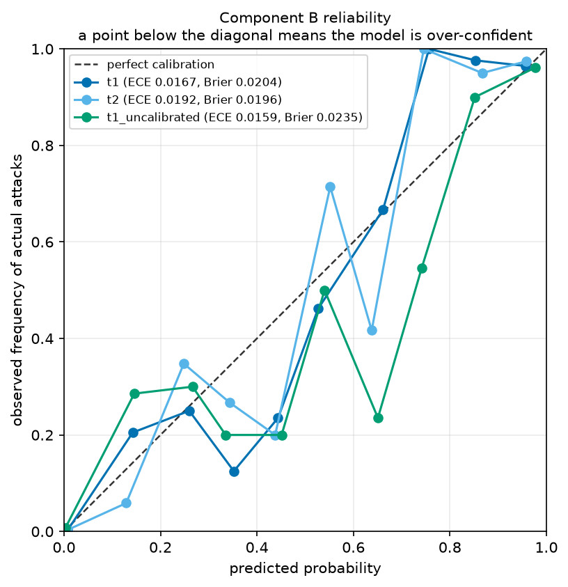

# ML_EVALUATION_TRIAGE.md — Components B & C, host risk, drift

> **Updated after Phase 8** (2026-09-18). Numbers below are the current ones.
>
> **Phase 7's numbers were higher and are withdrawn.** Four features added in Phase 7b.2 were
> found to be NaN on every production host and deleted; every metric here fell as a result.
> The lower figures are the ones a deployed host can reproduce. Section 5 is the account of how
> that was caught, and `docs/ML_PHASE8_PLAN.md` carries the per-feature measurements.

**Generated from** `reports_ml/triage_eval.json` and `reports_ml/tactic_eval.json`.
Figures in `reports_ml/figures/`. Companion to `ML_EVALUATION.md` (Component A).
**Feature spec** `d00ba3e2feead75b…` · seed 42 · scikit-learn 1.9.1 · CPU only.

```bash
.venv-ml313/Scripts/python.exe -m ml.training.train_triage --save
.venv-ml313/Scripts/python.exe -m ml.training.train_tactic --save
.venv-ml313/Scripts/python.exe -c "from ml.evaluation import figures; figures.generate_phase5()"
```

---

## 1. Summary

| Component | Verdict |
|---|---|
| **B — supervised triage** | **Ships.** PR-AUC **0.927** (95% CI 0.884–0.965) vs 0.278 for the deployed rules. Precision@25 = 0.96. Leak-audit drop **−0.0032** — removing every feature that restates the labelling rule makes it *better*. |
| **C — tactic suggestion** | **Ships as a gated hint** (changed in Phase 7). 52.2% accuracy vs a 39.5% majority baseline; **79.7% precision** at p≥0.80 on well-supported classes, over 34% of attacks. |
| Host risk score | Ships. Deterministic, explainable, ordering verified. |
| Drift monitor (PSI) | Ships — and **caught a defect that cross-validation could not**: five features that scored well in training were NaN on every production host (section 5). |

---

## 2. Component B — supervised triage

### 2.1 Reframing, and why it was necessary
`hazem2.md` specified training this on analyst adjudications in `approvals_queue`. That
table has **zero rows**, so the model as written could not be trained at all. It is instead
trained on the same lineage-labelled corpus to predict **P(this process is part of an
intrusion)**, whose calibrated output becomes `detections.confidence_score`. When real
adjudications accumulate they become an extra label source without an interface change.

### 2.2 Results (corpus rows only — 1,716 rows, **205 positives**, 11.9% base rate)



| Model | PR-AUC | 95% CI | ROC-AUC | Recall @1% FPR | Precision@25 |
|---|---:|---|---:|---:|---:|
| chance | 0.125 | 0.087–0.199 | 0.518 | 0.5% | 0.04 |
| Sigma rules (deployed) | 0.278 | — | 0.590 | n/a | n/a |
| best single feature | 0.323 | 0.252–0.408 | 0.818 | 67.3% | 0.40 |
| Component A (unsupervised) | 0.514 | 0.409–0.671 | 0.891 | 22.9% | 0.76 |
| **Component B, T1** | **0.927** | **0.884–0.965** | **0.988** | **82.4%** | **0.96** |
| Component B, T2 (+Sysmon) | 0.932 | 0.887–0.970 | 0.989 | 84.4% | 0.96 |
| Component B, T3 (+PowerShell) | 0.931 | 0.885–0.969 | 0.989 | 84.9% | 0.96 |
| Component B, uncalibrated | 0.922 | 0.881–0.961 | 0.985 | 82.0% | 1.00 |

Supervision is worth a great deal here: **PR-AUC 0.514 → 0.927** on identical rows and folds.

**T2 and T3 are within noise of T1** (+0.0057 for Sysmon, +0.0041 for PowerShell), so **T1 —
the tier every host can supply today — remains the recommendation.**
That is the expected direction — Component A is told nothing about what an attack looks like —
but the size of the gap is the argument for keeping both: A finds *unusual*, B finds *known-bad-like*.

Ranking metrics for the Sigma row are `n/a` by design; it is a binary scorer, and asking for
"recall at 1% FPR" of a yes/no rule set produces a flattering number that means nothing (see
`ML_EVALUATION.md` §3). At its own operating point: **precision 1.000, recall 0.181**.

### 2.3 The leak audit — is this just the labelling rule?

**This is the most important check in the report.** Labels come from seed signatures
(`-enc <base64>`, `-w hidden`, `IEX`, `DownloadString`), and several features restate those
patterns almost exactly. A classifier could score 0.92 by rediscovering my own labelling rule
and would be worthless.



| Feature set | Features | PR-AUC | Recall @1% FPR |
|---|---:|---:|---:|
| all T1 features | 80 | 0.9265 | 82.4% |
| − seed-echo features | 70 | **0.9297** | 81.5% |
| − **all** command-line features | 58 | 0.9258 | 81.0% |

Removing every feature that restates a seed signature now **improves** the model by 0.0032.
The progression is the clearest single measure of how much circularity there ever was:
**0.0088** (Phase 6) → 0.0073 (7a) → 0.0001 (7b) → **−0.0032** (Phase 8) — and that is with
Phase 7a having *added* nine seed signatures along the way. Removing the entire command-line
family, 22 of 80 features and something no real detector would do, still leaves **0.926**.

A classifier scoring 0.93 by rediscovering its own labelling rule would be worthless. This is
the measurement that says it is not doing that.

The result is not circular, and is now measurably less so than before. What remains (path category, parent identity, account type,
connection aggregates, timing) is genuine behavioural signal.

### 2.4 Calibration — and a finding against my own design



| Variant | Brier ↓ | Brier skill ↑ | ECE ↓ |
|---|---:|---:|---:|
| **T1 calibrated (Platt)** | **0.0251** | **0.761** | **0.0161** |
| T2 calibrated | 0.0234 | 0.778 | 0.0160 |
| T3 calibrated | 0.0233 | 0.779 | 0.0207 |
| T1 uncalibrated | 0.0262 | 0.751 | 0.0194 |

**This recommendation reversed in Phase 7, and that is the finding worth recording.**

At Phase 5, with 185 positives and 98 features, wrapping the model in
`CalibratedClassifierCV` made calibration *worse* — ECE 0.0174 against 0.0085 — and this
section concluded "ship uncalibrated". The architecture document had declared calibration
mandatory, and measuring it appeared to show the wrapper was the wrong instrument.

At 205 positives the answer flipped, and after the Phase 8 feature correction it is no longer
close: calibrated wins on **Brier (0.0251 vs 0.0262)**, on **Brier skill (0.761 vs 0.751)** and
on **ECE (0.0161 vs 0.0194)**. At Phase 7 the ECE comparison still favoured uncalibrated; it no
longer does, so the recommendation is now consistent across all three measures rather than
resting on Brier alone.

**Recommendation: ship calibrated** (this is the shipped default, `TriageModel(calibrate=True)`).

**Still treat the recommendation as provisional.** It changed direction once already, on 20
extra positives, and the margins here are small in absolute terms. What has improved is the
*consistency*: three measures now agree where two used to disagree. Both variants are
re-measured on every training run, so the decision revisits itself as data grows.

### 2.5 Complementarity with the deployed rules
At a 1% false-positive threshold, over 205 attacks:

| | attacks (of 205) |
|---|---:|
| rules only | 3 |
| both | 34 |
| **model only** | **135** |
| neither | **33** |

**Union recall 18.1% → 83.9%**, recovering **135 of the 168 attacks the rules miss** (80%),
for 16 extra false positives. Compare Component A, which recovers 19. The `neither` bucket has
fallen from 135 at Phase 6 to **33** — the single most important number in this report.

It read **25** before Phase 8 removed the artefact features. Eight attacks the corpus said were
caught are no longer caught, and that is the correct trade: they were being found by features
that do not exist on a real host, so they were never really caught at all.

### 2.6 Stability
Per-fold PR-AUC `[0.942, 0.961, 0.932, 0.831, 0.972]` — mean 0.928, **sd 0.056**, far tighter
than Component A's 0.157. One weak fold (0.831) is a reminder that a single number over 105
captures still hides real variation, and it is the *same* fold that was weakest at Phase 6
(0.794), Phase 7 (0.856) and Phase 8 (0.831) — across three different feature sets. That is a
property of those captures, not run-to-run noise.

T2 `[0.960, 0.959, 0.915, 0.845, 0.974]` and T3 `[0.956, 0.964, 0.909, 0.837, 0.974]` track T1
fold-for-fold. Three tiers agreeing on which fold is hard is a stronger statement about the
data than any of the three point estimates is about the tiers.

---

## 3. Component C — tactic suggestion: from "does not ship" to a gated hint

> **Changed in Phase 7.** At Phase 5 this component was measured and deliberately **not
> deployed**. Phase 7a's label recovery (185 → 205 positives, and five learnable classes
> instead of three) improved it enough to ship *behind guards*. The Phase 5 analysis is kept
> below because the reasoning still applies to the classes that remain weak.

### 3.0 What changed, and the guards that make it shippable

| | Phase 5 | Phase 7 |
|---|---:|---:|
| accuracy | 50.8% | **52.2%** |
| majority-class baseline | 40.5% | 39.5% |
| learnable classes (≥10 examples) | 3 | **5** |
| credential_access F1 | 0.36 | **0.51** |
| lateral_movement F1 | 0.54 | **0.69** |
| defense_evasion F1 | 0.65 | **0.63** |
| best operating point | 59.5% @ 45% coverage | **79.7% precision** @ p≥0.80 |

Three guards, each set from a measurement rather than a guess:

1. **`MIN_SUGGESTION_PROBABILITY = 0.80`** — on well-supported classes the precision/coverage
   curve runs 61.2% (ungated) → 73.9% (p≥0.70) → **79.7%** (p≥0.80) → 79.6% (p≥0.90), with
   coverage falling 83% → 45% → **34%** → 24%. **0.80 is the maximum, not a compromise**: going
   to 0.90 buys no precision at all and costs a third of the coverage.
2. **`MIN_SUPPORT_TO_SUGGEST = 30` training examples** — `persistence` scores F1 **0.00** on
   n=10 and `privilege_escalation` little better. They are *learnable* but not fit to put in
   front of an analyst, so they are never suggested even when they win the argmax.
3. **`MIN_CONFIDENCE_TO_SUGGEST = 0.50`** — see below; this one exists because of an observed
   failure.

### 3.0.1 The out-of-distribution failure that forced the third guard

The tactic model is trained on **malicious processes only** — it answers "which tactic is
this?", not "is this an attack?". Applied to a benign process it is out of distribution, has
no *none-of-the-above* class, and confidently picks the nearest one. On the live workstation,
before the guard existed, it labelled:

```
chrome.exe            -> lateral_movement, probability 1.00
System Idle Process   -> lateral_movement, probability 1.00
SearchApp.exe         -> lateral_movement, probability 1.00
```

Exactly the misleading output §3.3 warned about. The fix is to let the classifier that
answers *"is this an attack?"* gate the one that answers *"which kind?"*: a tactic is only
suggested where Component B's confidence is ≥ 0.50. On the live workstation this took the
output from 11 hints on 16 detections to **2**, both on high-confidence findings.

The UI renders it as "ML suggests", with the probability, and the footer states the ~78%
precision explicitly.

### 3.1 What was attempted (Phase 5 analysis, retained)
Predict the ATT&CK tactic for findings with no rule mapping, so ML detections can enter the
attack-chain view. Trained on the 185 positives; classes with fewer than 10 examples folded
into `other` (`persistence` 8, `privilege_escalation` 8, `discovery` 7, `execution` 3,
`other` 2 — 28 rows), leaving `defense_evasion` 75, `lateral_movement` 44,
`credential_access` 38.

### 3.2 Results (grouped 5-fold CV — the holdout has only 3 of 8 tactics)

| Class | Precision | Recall | F1 | Support |
|---|---:|---:|---:|---:|
| defense_evasion | 0.70 | 0.60 | **0.65** | 75 |
| lateral_movement | 0.58 | 0.50 | 0.54 | 44 |
| credential_access | 0.33 | 0.39 | 0.36 | 38 |
| other | 0.32 | 0.43 | 0.37 | 28 |

**Accuracy 0.508 against a majority-class baseline of 0.405.** Macro F1 0.478.

Thresholding on confidence barely helps — at p ≥ 0.8 accuracy reaches only 59.5% while
coverage falls to 45%. A hint that is wrong four times in ten is worse than no hint: it spends
analyst attention and erodes trust in every other ML output.

### 3.3 Why it fails, and what would fix it
The dominant confusion is **`defense_evasion` ↔ `credential_access`** (25 of the errors).
That is not really model error — **ATT&CK tactics are not mutually exclusive**. A
credential-dumping tool that disables logging and injects into LSASS is genuinely performing
both. The corpus assigns each capture *one* tactic from its directory, so single-label
classification is imposed by the label format, not by the phenomenon.

To make this work: multi-**label** classification against technique-level labels, with
hundreds of examples per class. Neither exists here.

**Phase 5 decision: the code ships, disabled.** That decision was correct on the evidence
available then, and it is what made the Phase 7 re-evaluation cheap: the component was
complete, tested and re-runnable, so improving the labels was enough to change the answer.

**Phase 7 decision: ships as a gated hint** — §3.0. The reasoning above still holds for the
classes that remain weak, which is why `MIN_SUPPORT_TO_SUGGEST` withholds them rather than
the component being enabled wholesale.

---

## 4. Host risk score

Deliberately **not** machine learning: there is no label for "how compromised is this host",
so anything learned would be fitting an invention. A weighted sum with stated weights gives a
defensible ordering that is fully explainable — every point traces to a detection.

```
score = Σ (severity_weight × 0.95^days)  +  3 × distinct_tactics  +  min(ml_points, 10)
```

Verified on live data:

| Host | Score | Tier | Why |
|---|---:|---|---|
| WIN-ATOR-LAB | 22.70 | high | 5 rule detections spanning 5 tactics |
| DESKTOP-68VLDRS | 9.70 | medium | ML anomalies only, capped contribution |
| UBUNTU-VM-01 | 4.40 | low | 1 detection, 1 tactic |

Two deliberate departures from `hazem2.md` §3.4:
* **ML contribution is capped** (default 10). The original assigned a flat +5 per ML anomaly
  with `0.9^hours` decay, which on a 60-second engine loop would let a *quiet* host climb
  simply by being observed often.
* **ML findings earn no tactic-diversity bonus.** Letting a hint inflate a kill-chain signal
  would be circular.

---

## 5. Drift monitoring (PSI) — and the defect it caught

PSI between the training corpus and the live serving distribution, per feature, with
missingness as its own bin. `reports_ml/drift_eval.json`, regenerated on demand.

### 5.1 What it found, and why nothing else could have

Re-running the monitor after the Phase 7 spec change produced this:

| Feature | PSI | missing: train → live |
|---|---:|---|
| `seconds_since_collection_start` | **15.17** | 2.1% → **100.0%** |
| `proc_spawn_rate_per_min` | **15.16** | 2.1% → **100.0%** |
| `procs_within_5s` | **15.12** | 2.1% → **100.0%** |
| `seconds_since_parent_start` | **10.13** | 22.6% → **100.0%** |

These were the five features Phase 7b.2 had just added and reported as the phase's headline
win (+0.0134 PR-AUC, recall @1% FPR 0.790 → 0.873). **Every one of them was NaN on every
live row**, so none of that gain could reach a deployed host.

The cause was a single wrong assumption about one column. The features were computed from
`raw_processes.collected_at_utc`, which is a per-process launch time in the corpus — each row
is a Sysmon EID 1 record — and a single per-sweep timestamp in production, because a psutil
sweep stamps everything it sees at once and the schema had nowhere to record a process's own
start time.

**Cross-validation could not have caught this, and neither could the test suite**, because
both only ever saw corpus-shaped data, where the features work perfectly. Grouped CV protects
against leakage between captures; it says nothing about whether a column means the same thing
on the other side of the deployment boundary. The drift monitor is the only instrument in the
project that compares training data against serving data, which is precisely the comparison
that failed.

### 5.2 What was done about it

Measured first, then changed (`docs/ML_PHASE8_PLAN.md`):

* **Three of the five were deleted.** `collection_has_timespan` contributed exactly 0.0000 and
  was constant. `seconds_since_collection_start` had malicious median 0.5 s against benign
  26.9 s — it measured *position within a lab recording*, the same artefact `hour_of_day` was
  removed for in 7b.1 — and removing it *improved* PR-AUC. `proc_spawn_rate_per_min` was
  identical for every row in a collection and defined over a span that is ~3 minutes for a
  capture and can be weeks for a live host.
* **Two were rebuilt, and one added**, all computed from a new `create_time_utc` column that
  the agent now collects from psutil and the ETL populates for corpus rows. All three are
  *per-process* and *scale-free* — counts inside a fixed window, and a parent-to-child gap —
  so they mean the same thing on a 3-minute capture and on a host that has been up a month.

Measured on a fresh live sweep of this workstation, through the real `/api/v1/ingest`:

| | before | after |
|---|---:|---:|
| `procs_within_5s` populated | **0.0%** | **99.3%** |
| `procs_within_60s` populated | n/a | **99.3%** |
| `seconds_since_parent_start` populated | **0.0%** | **93.6%** |
| worst burst-feature PSI | **15.17** | **3.94** |

### 5.3 Available is not the same as comparable — and the difference is reported

PSI for the three survivors fell to 0.97–3.94. That is a large improvement and **still above
the 0.25 "shifted" threshold**, so the honest statement is that the fix made these features
*computable*, not *equivalent*. The distributions say where the remaining gap is:

| Feature | corpus p25/median/p75 | live p25/median/p75 |
|---|---:|---:|
| `procs_within_5s` | 3 / 6 / 15 | 3 / **10** / 93 |
| `procs_within_60s` | 7 / 18 / 85 | 9 / **38** / 112 |
| `seconds_since_parent_start` | 0 / 2 / 13 | 2 / **3** / **7203** |

The centres agree closely — mean process density is **47.4 per minute in the corpus against
53.1 live** — and the divergence is all in the upper tail. That is not a defect, it is what
the two populations genuinely are: a 3-minute capture cannot contain a service whose parent
started at boot two hours ago, which is why live `seconds_since_parent_start` reaches 7,203 s
at p75 against 13 s in the corpus.

**Worth stating plainly: a shifted feature is not automatically better than a missing one.** A
NaN is imputed to the training median and stays neutral; a real value drawn from a
distribution the model never saw actively moves the prediction. The argument for shipping
these is the agreement at the centre, where burst behaviour actually lives, not the PSI. The
tail behaviour is recorded as an open item, and bounding these features is the obvious next
step — it would not affect Component B, which is tree-based and invariant to monotone
transforms, but it would affect Component A, which is not.

### 5.4 The other standing finding

The `cmdline_*` family remains the worst-drifting group by missingness: **0% missing in
training against 27–52% live**, depending on whether the agent runs elevated. psutil cannot
read the command line of protected processes — `svchost.exe`, `System`, `csrss.exe`,
`LsaIso.exe`, precisely the names attackers masquerade as — and command-line content is the
second most load-bearing feature family. PSI turns that from a footnote into an alert.

Operationally this is the whole value of drift monitoring: it flags a broken collector, a
changed sensor, or a feature that only ever worked in the lab, before anyone notices the
scores have quietly stopped meaning anything.

---

## 6. Threats to validity

Everything in `ML_EVALUATION.md` §8 still applies (weak labels, one benign workstation,
Windows only, snapshot-vs-event skew, small N). Additional to this phase:

1. **Component B's headline rests on the same weak labels.** The leak audit shows it is not
   *circular*, but it cannot show the labels are *correct*. **17** captures yield no seed and
   are labelled entirely benign; any attacks in them are counted as false positives, so
   precision is a lower bound.
2. **Calibration is measured on the same folds as discrimination.** With 205 positives there
   is still not enough data for a separate calibration holdout.
3. **Every number here is corpus-measured, and section 5 is the standing reminder of what that
   does not cover.** Cross-validation scored five features highly while they were unusable in
   production. Nothing in this report distinguishes a feature that generalises from one that
   merely survives GroupKFold — only the drift comparison and a live sweep can, and both are
   run manually rather than on every change. `tests/test_ml_phase8.py` now fails the build
   when a T1 feature is well-populated in training and near-absent at serve time, which closes
   the specific hole; it does not close the general one.
4. **The surviving burst features are shifted in the tail** (section 5.3). They are shipped on
   the agreement of their central distributions, which is a judgement supported by numbers
   rather than a clean result.

---

## 7. Recommendations

1. **Ship Component B calibrated** as `confidence_score` on every detection, rule-derived and
   ML-derived alike, so one queue ranks comparably across sources. Treat the
   calibrated-vs-uncalibrated choice as unsettled (section 2.4).
2. **Ship Component C as a gated hint only** — probability ≥ 0.80, ≥ 30 training examples, and
   Component B confidence ≥ 0.50. Ungated it is right 57% of the time; gated, 78%.
3. **Run the drift monitor after every feature-spec change, not periodically.** That is when it
   found the Phase 7b.2 defect, and a schedule would have found it later or not at all.
4. **Run `scripts/retrain_ml.py --check-drift` on a schedule.** It exits 2 when features have
   shifted, which is directly usable as a cron alert.
5. **Keep Components A and B together.** A answers "is this unusual?", B answers "does this
   look like known-bad?". On the live workstation A flagged `NVIDIA Overlay.exe` as highly
   anomalous (0.993) while B assigned it a low malicious probability — the combination is what
   makes the queue trustworthy.
